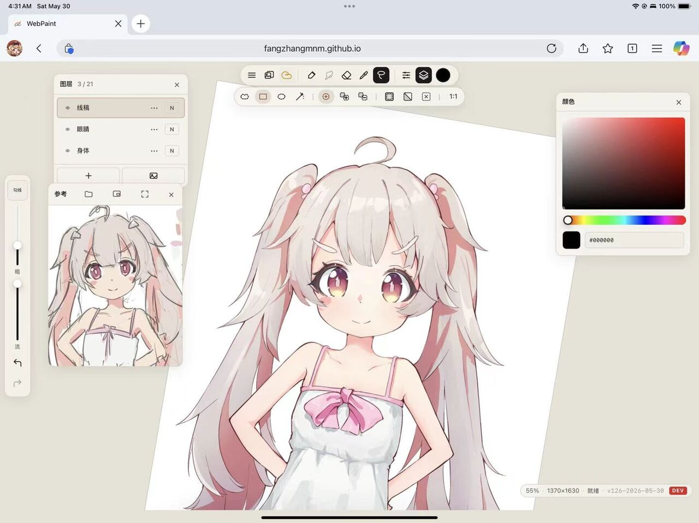
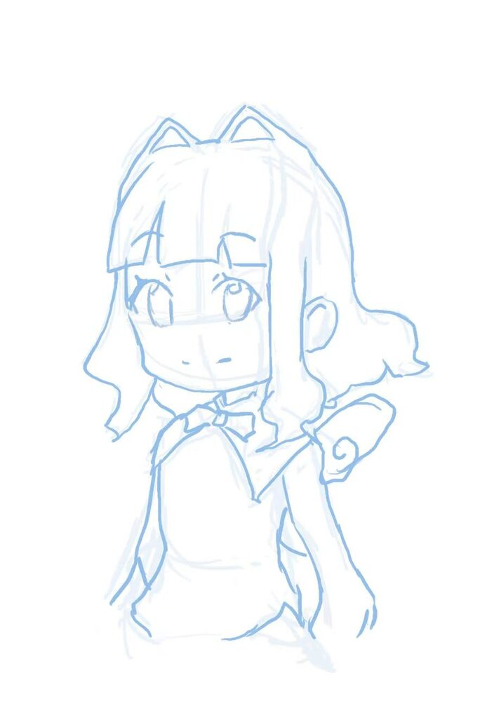

# WebPaint 打开即用的开源画画软件

开源的网页版画画软件。目标是在二次元和3D手绘贴图领域追上Procreate的手感和画质，同时保持开源的灵活可修改性。

### 怎么用？

点开：https://fangzhangmnm.github.io/webpaint/

## 这是一款什么样的软件

### 开源 = 你可以按需修改

开源意味着你可以自己（或者让AI）修改源代码，加入自己喜欢的功能，或者和自己的工作流对接。

比如画好之后一键推送到Blender贴图内存，或者和Galgame数据库同步热加载，甚至是WYSIWYG的世界地图编辑器。你也可以接入你最喜欢的AI大模型，一键整理线稿，生成素材。技术宅也可以把自己写的科研，数学代码，比如分形，有趣的图形学算法（比如自动生成玫瑰花的L系统，或者大气散射模型）加进来，利用本软件的交互性和专业的画图功能进行快速迭代修改——当然，你也可以简单的导入一个Live2D猫娘每天督促你画画。

这个Modding的自由度是闭源软件所不具有的。

当然，如果你不想那68块钱买Procreate的，讨厌Photoshop的订阅制度，或者想要在PC端拥有类Procreate的手感、体验的话，也欢迎来捡漏。

### UX为艺术体验优化，直观易用，美术生友好

本软件完全用龙虾(Coding Agent)写成，v126版本（二次元绘画场景基本跑通）只用了三天，我没有写一行代码。

但是在整个开发过程中，我以一个有实际二次元绘画经验的艺术家的身份实时监督：调试了手感，UX（操作是否直观易用，是否和艺术家的肌肉记忆打架），初始笔刷预设。

一些老牌的开源画图软件虽然精神可敬，也有着有趣的社区。但是因为开发者很多都是没有太多艺术经验的程序员，所以UI反直觉。资料都是英文的，学起来很难。但更困扰广大初学者的是：社区教程，出场预设，往往都是“程序员美术”。所以虽然这些软件有着完整的能够用来进行专业的艺术创造的功能，但缺乏大牛带路，很多人都不知道该怎么设置，使用什么样的工作流。最终还是决定回归有着大量艺术教程和成功实践经验的商业软件。

所以，我根据自己绘画的经验，尽量给画画的初学者创作了一个直观，易学，UX具有引导性的绘画环境。开箱可用。在二次元场景中可以无缝移植Procreate教程。

*fangzhangmnm*
*May.30 2026, 于Long Island*

### 网盘同步，离线可用，不需要服务器

Ipad打开网页就可以画，登陆微软Onedrive网盘后可以自动同步网盘文件夹，多端同步，电脑上打开就能看。丢Ipad不丢画。省去了整理的大麻烦。

可以讲本网页App(Progressive Web App, PWA)下载到Ipad主屏幕上。离线可用。有Wifi时自动同步你的进度到网盘（版本冲突不丢画）。怎么做[请看这里](AITODO insert link)

但是，这个软件完全属于你自己，不需要服务器。你可以挑一个喜欢的版本把这个repo fork下来自己托管。怎么做[请看这里](AITODO insert link)

- [ ] 国内网盘和墙内镜像部署

## 目前跑通的垂直绘画场景

配图都是我亲手用这个软件画的。技术不好请见谅。

- [x] 草稿构思和起形（已跑通）
    - [x] 参考小窗（第一步就是找参考！老手也一样！）
    - [x] 有压感的笔刷和橡皮，支持数位笔，鼠标，指绘
    - [x] Undo, Redo, Pan, Zoom
    - [x] 自动保存，导入导出，网盘备份
    - [x] 液化（调整比例，身材必备！再也不怕画歪！）
    - [x] 选区，变换工具

- [x] 二次元线稿勾线（已跑通）
    - [x] 高质量的笔刷，半透明，流量，硬度
    - [x] 平滑防抖
    - [x] 旋转、放大画布
    - [x] 图层系统，支持导入参考图片
    - [x] 半透明图层叠加，图层可见性
    - [ ] 我自己发明的鼠绘算法（可以画出压感！）
    - [ ] 锁定透明像素
    - [ ] 接入清理线稿的AI模型

- [ ] 建筑机械机甲场景
    - [ ] 几何笔刷（直线，圆规）

- [ ] 二次元赛璐璐平涂场景（未跑通）
    - [x] HSV滑块，吸色
    - [x] 套索，选区
    - [x] 套索上色功能（二分画的干净）
    - [x] 魔棒选区（有些人喜欢用）
    - [x] 图层蒙板
    - [x] 图层叠加模式
    - [x] 剪切蒙板（画二次元的都在用！）
    - [x] 喷枪
    - [ ] 手指涂抹工具（身体和腿的渐变，老师叫我平涂时少用）
    - [x] 合并图层
    - [ ] 图层组

- [ ] 像素画（未跑通）
    - [x] Pixel Perfect像素笔刷
    - [x] Nearest Neighbor像素插值变换

- [ ] 手绘贴图厚涂场景
    - [ ] 水彩，混色
    - [ ] 手指涂抹工具
    - [ ] 纹理笔刷
    - [ ] 撒小星星的笔刷（Jittering, Scattering, H/S/V Variation, Size/Rotation Variation)
    - [ ] 和Blender直接通信，一键更新贴图
    - [ ] Tiling Preview（预览无缝贴图）

- [ ] Matte Paint背景图绘制场景

- [ ] 类BodyPaint直接在3D模型上绘制

- [ ] 接入AI场景
    - [ ] 线稿清理，补空，闭塞
    - [ ] Waifu2x超分辨率

## 使用手册

### 快捷键和手势一览

AITODO

### 常见的画画流程

### 如何安装离线版本

AITODO

### 如何绑定网盘

AITODO

### 如何和Blender通信

### 如何绑定AI API

### 如何自己托管并开发自己的定制版本

AITODO，记得提一下client id之类的